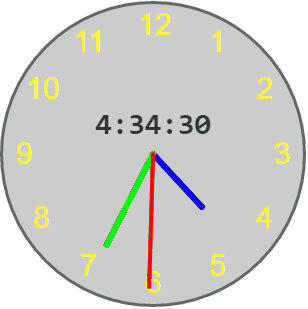

# jquery.analogClock.js
An analog clock widget



##options

```javascript
$(".clock").analogClock({
	width: 300,
	backgroundColor: "#ccc",
	borderColor: "#666",
	borderWidth: 3,
	numberColor: "#ff0",
	numberSize: 30,
	numberPadding: 6,
	showSecond: true,
	smoothSecond: true,
	secondColor: "#f00",
	secondWidth: 4,
	showMinute: true,
	minuteColor: "#0f0",
	minuteWidth: 6,
	hourColor: "#00f",
	hourWidth: 6,
	showDigital: true,
	digitalColor: "#333"
});
```
